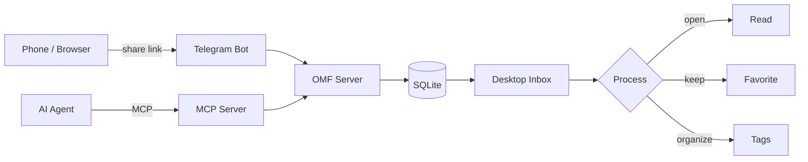
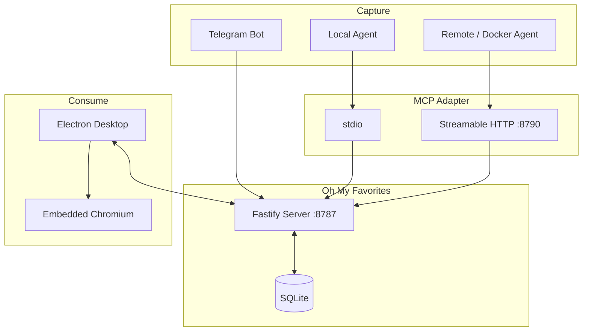

# Oh My Favorites

<p align="center">
  
</p>

<h3 align="center">做一只快乐的互联网小仓鼠</h3>

<p align="center">
  A self-hosted, cross-platform inbox for the links you do not have time for right now.<br/>
  Send them from your phone, Telegram, or an AI agent — then come back to one clean desktop queue.
</p>

<p align="center">
  <a href="./README.zh-CN.md">简体中文</a>
  ·
  <a href="#quick-start">Quick Start</a>
  ·
  <a href="#agent--mcp">MCP</a>
</p>

<p align="center">
  
  
  
  
  
</p>

---

## Why Oh My Favorites?

Every platform has its own *Watch Later*, *Favorites*, or *Bookmarks* — and none of them talk to each other.

Oh My Favorites turns all of those scattered “I will look at this later” moments into one inbox:

- see a Bilibili or YouTube video on your phone → forward the link;
- find a useful article, repository, or paper → send it to the bot;
- ask an agent to inspect a page → let it choose a clean title and tags;
- when you are back at your PC → process everything from one desktop app.

The core idea is intentionally small:

> **Capture with almost zero friction. Consume later in one place.**

## Workflow



## Highlights

| | Feature | What it does |
| --- | --- | --- |
| 📥 | **Unified inbox** | Collect links from Telegram, desktop, or MCP-capable agents. |
| 👀 | **Unread / read** | New saves stay unread until you actually open or explicitly update them. |
| ⭐ | **Favorites** | Keep the items that deserve long-term attention. |
| 🏷️ | **Tags** | Add multiple tags and browse by topic. |
| ✏️ | **Custom titles** | Rename entries manually or let an agent supply a better title. |
| 🤖 | **Agent-ready** | Local stdio MCP and remote Streamable HTTP MCP are both supported. |
| 📱 | **Mobile-friendly capture** | Forward a URL to Telegram instead of fighting with browser bookmark UIs. |
| 🖥️ | **Desktop reading** | Electron client with an embedded, isolated Chromium view. |
| 🌗 | **Desktop UX** | Light/dark theme, collapsible navigation, timeline, unread, favorites, and tags. |
| 🐳 | **Self-hosted** | Fastify + SQLite backend deployable with Docker Compose. |

## Architecture

The protocol adapters are separated from the main business service. Telegram and MCP ultimately use the same server-side item model and REST API.



### Repository layout

```text
apps/
├── desktop/      Electron + React desktop client
├── mcp-server/   stdio + Streamable HTTP MCP adapter
└── server/       Fastify API + Telegram bot

packages/
├── database/     Drizzle schema + SQLite setup
└── shared/       Shared TypeScript contracts
```

## Quick Start

### Requirements

- Node.js 24+
- pnpm 12+
- Docker + Docker Compose

### 1. Install

```bash
pnpm install
cp .env.example .env
```

At minimum, set a strong API token:

```env
API_TOKEN=replace-with-a-long-random-token
```

### 2. Start the server

```bash
docker compose up -d --build
```

The REST API is available at `http://localhost:8787`.

### 3. Start the desktop app

```bash
pnpm dev:desktop
```

Open **Settings** in the desktop app and configure:

- Server URL: `http://localhost:8787`
- API token: the same value as `API_TOKEN`

## Telegram Capture

Telegram is optional. Add these values to `.env`:

```env
TELEGRAM_BOT_TOKEN=123456:your-bot-token
TELEGRAM_ALLOWED_USER_ID=123456789
```

Supported messages:

```text
https://example.com
https://example.com My custom title
```

Only the configured Telegram user ID may submit URLs.

## Agent / MCP

The MCP adapter lets an agent inspect a page using its own browser, choose a useful title and tags, and save the result to Oh My Favorites.

Available tools:

```text
save_url
get_item
list_items
list_tags
update_item
add_tags
remove_tags
```

`save_url` always keeps a newly saved item **unread**. Read state can still be changed explicitly with `update_item`.

### Local stdio MCP

Build it:

```bash
pnpm build:mcp
```

Generic client configuration:

```json
{
  "mcpServers": {
    "oh-my-favorites": {
      "command": "node",
      "args": ["/absolute/path/to/oh-my-favorites/apps/mcp-server/dist/index.js"],
      "env": {
        "OMF_BASE_URL": "http://127.0.0.1:8787",
        "OMF_API_TOKEN": "your-server-api-token"
      }
    }
  }
}
```

### Remote Streamable HTTP MCP

Add a separate MCP token to `.env`:

```env
MCP_TOKEN=replace-with-a-different-long-random-token
MCP_PORT=8790
```

Start both services:

```bash
docker compose --profile mcp up -d --build
```

Remote MCP endpoint:

```text
http://localhost:8790/mcp
```

Clients authenticate with:

```http
Authorization: Bearer <MCP_TOKEN>
```

If the MCP endpoint is reachable over the public internet, put it behind HTTPS.

### Hermes example

For Hermes running in Docker Desktop on macOS:

```bash
hermes mcp add oh-my-favorites \
  --url http://host.docker.internal:8790/mcp \
  --auth header
```

Enter the raw `MCP_TOKEN` value when Hermes asks for the bearer token.

More details: [`apps/mcp-server/README.md`](./apps/mcp-server/README.md).

## Desktop Packaging

Package with electron-builder:

```bash
pnpm --filter @oh-my-favorites/desktop package
```

Configured targets:

- macOS: DMG + ZIP
- Windows: NSIS
- Linux: AppImage

Artifacts are written to `apps/desktop/release/`.

## Data & Security

- SQLite data lives in the Docker volume `favorites-data` by default.
- `readStatus` and `isFavorite` are independent states.
- Metadata fetching validates DNS/IP targets and redirects to reduce SSRF risk.
- Metadata downloads use time and size limits.
- Remote pages run in an isolated Electron browser session with Node.js disabled.
- `/api/*` uses bearer-token authentication.
- Remote MCP uses a separate `MCP_TOKEN`.

## Development

```bash
# server + desktop
pnpm dev

# verification
pnpm test
pnpm typecheck
pnpm build
```

---

<p align="center">
  <b>One inbox for everything you meant to come back to.</b>
</p>
